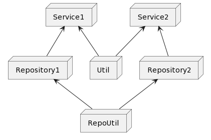

# di visualizer cli

use all commands at the root of project

di_visualizer \
    di \
    --directory lib/src \
    --output uml.txt

## info
tool for visualization your di dependencies

use `@diService` annotation for your class
and `@diInject` for fields in your service

and get uml diagram:

```uml
@startuml

node Service1
node Service2
node Util
node RepoUtil
node Repository1
node Repository2
Util -up-> Service1
Repository1 -up-> Service1
Util -up-> Service2
Repository2 -up-> Service2
RepoUtil -up-> Repository1
RepoUtil -up-> Repository2

@enduml
```

  

# run:

install it and run from root of your app:

```bash
di_visualizer di --directory example/ --output uml.txt
```