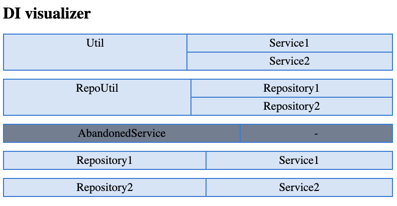

# di visualizer cli

## info
tool for visualization your di dependencies

use `@diService` annotation for your class

and get `uml/html` diagram:

```uml
@startuml

node Service1
node Service2
node Util
node RepoUtil
node Repository1
node Repository2
Util -up-> Service1
Repository1 -up-> Service1
Util -up-> Service2
Repository2 -up-> Service2
RepoUtil -up-> Repository1
RepoUtil -up-> Repository2

@enduml
```

  


  

## output format:
use argument `--format` to change format:
- `uml`
- `html`


# run:
install it and run from root of your app:

```bash
di_visualizer di --directory example/ --output uml.txt --format html
```

and use any editors to see your uml, for example: [https://www.planttext.com/](https://www.planttext.com/)